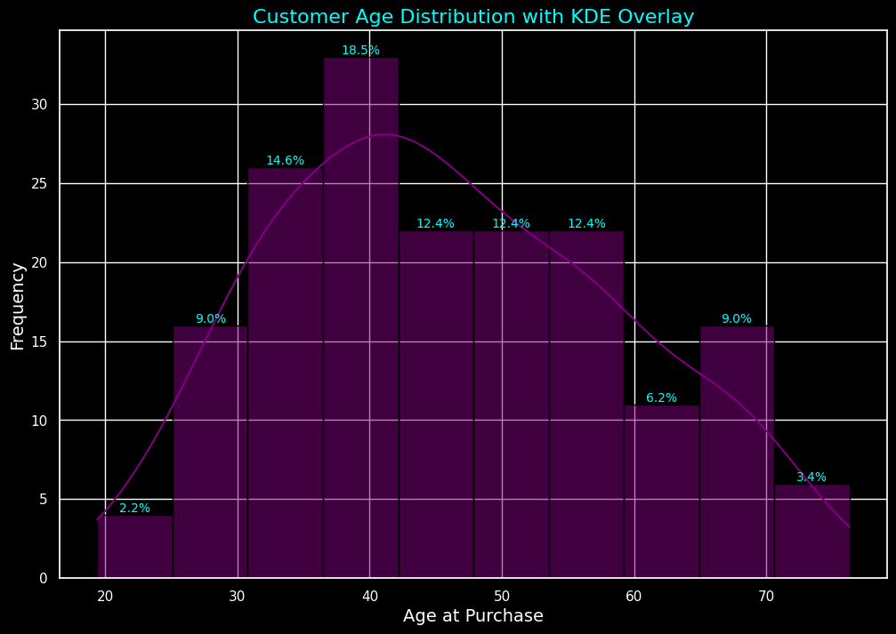

# Real Estate Market Analysis 🏡
[View Interactive Notebook on Google Colab](https://colab.research.google.com/drive/1-HLBaRUZXVK2_9r7JcGlLYiVg-2sMngZ?usp=sharing)


A comprehensive analysis of customer profiles, property characteristics, and country insights in the real estate market.

---

## **Key Insights**
### 1. Customer Age Profile
- Buyers in the **36–42 age group** are the most active, purchasing the highest number of properties.
- Tailored marketing campaigns for the **31–48 age group** can maximize engagement and conversions.



### 2. Property Price Distribution
- Properties priced **200,000–285,000** experience the highest demand.
- Strategic focus on mid-tier properties is key to capturing market opportunities.


### 3. Geographic Trends
- **California** leads with the highest demand, followed by emerging markets in **Nevada** and **Arizona**.
- Regional pricing adjustments and targeted marketing strategies can drive growth.


### 4. Country Insights 🌍
- **Canada** and **Germany** showcase perfect customer satisfaction scores.
- International expansion strategies should emulate their successful models.


---

## **How to Use This Repository**
### Structure:
```plaintext
real-estate-analysis/
├── README.md
├── data/
│   ├── raw_data.csv
│   ├── cleaned_data.csv
├── notebooks/
│   ├── analysis.ipynb
├── results/
│   ├── customer_age_profile.png
│   ├── property_price_distribution.png
│   ├── state_distribution_map.png
│   ├── country_insights.png
├── scripts/
│   ├── data_cleaning.py
│   ├── visualization.py
